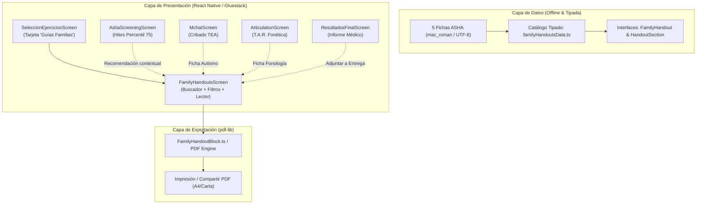

# Plan de Integración: Guías Clínicas de Orientación Familiar y Estimulación ASHA en VIA+

## Goal Description
Integrar en la plataforma médica **VIA+** (rama `miguelina`) los **5 documentos clínicos y educativos de orientación familiar** basados en la evidencia científica de la **American Speech-Language-Hearing Association (ASHA)** y adaptados al contexto sociosanitario (incluyendo rutas de derivación en República Dominicana como el CAID, SNS y MINERD).

Los 5 documentos a integrar son:
1. **Guía 1 — Señales de alerta por edad (0 a 5 años)**: Hitos clave (12m, 18m, 24m, 3+ años), pautas de estimulación por etapa y criterios de alarma. *(Ref: ASHA Early Identification)*.
2. **Guía 2 — Habla vs. Lenguaje**: Diferenciación clínica entre producción fonatoria/motora (articulación, fluidez, voz) y sistemas lingüísticos (vocabulario, gramática, uso social). *(Ref: ASHA What is Speech? What is Language?)*.
3. **Guía 3 — Entender vs. Hablar (Receptivo vs. Expresivo)**: Manejo del "hablante tardío" (*late language emergence*, 18–30 meses), niveles de imitación, técnica de saboteo de juego y retención estimulante. *(Ref: ASHA Late Language Emergence)*.
4. **Guía 4 — Señales tempranas de autismo (TEA)**: Banderas rojas en interacción social y comunicación, técnicas de atención conjunta, rutinas en el hogar y derivación especializada al CAID/pediatría. *(Ref: ASHA Autism Spectrum Disorder)*.
5. **Guía 5 — Cuando las palabras suenan “raras” (Articulación y Fonología)**: Cronograma de adquisición de fonemas por edad, técnicas de bombardeo auditivo, modelado positivo sin corrección punitiva y juegos de soplo. *(Ref: ASHA Speech Sound Disorders)*.
*(Opcional / Complementario: Ficha 6 / Resumen consolidado "¿Necesito una evaluación? — Guía rápida por áreas").*

El objetivo es transformar estos textos en un subsistema clínico de primera clase en VIA+: interactivo, tipado en TypeScript, 100% offline-first, exportable en PDF de alta fidelidad para entrega inmediata al cuidador tras la consulta, y vinculado contextualmente a los módulos diagnósticos correspondientes.

---

## User Review Required

> [!IMPORTANT]
> **Puntos clave de decisión clínica y técnica:**
> 1. **Acceso Principal**: Se propone añadir una tarjeta de acceso directo en el Hub clínico (`SeleccionEjerciciosScreen.tsx`) bajo la categoría de recursos / neurodesarrollo ("Guías para Familias · ASHA"), así como un acceso en la barra superior o en `ResultadosFinalScreen`.
> 2. **Entrega a la Familia (PDF Individual)**: Cada guía podrá exportarse e imprimirse como un documento PDF individual (A4/Carta) con el membrete clínico de VIA+, el profesional responsable y el identificador de la sesión.
> 3. **Vinculación Contextual Automática**:
>    - Al evaluar en `AshaScreeningScreen`: Si se detecta riesgo o banderas rojas, sugerir directamente la guía correspondiente a la edad o área alterada.
>    - En `MchatScreen`: Botón rápido para entregar la guía de señales tempranas de TEA.
>    - En `ArticulationScreen`: Botón rápido para la guía de fonología y articulación.
> 4. **Identificación del Profesional**: Los documentos originales incluyen el pie `[Tu nombre, credenciales, contacto]`. En VIA+, este campo se rellenará automáticamente a partir del profesional activo en la sesión (o datos de la clínica).

---

## Open Questions

> [!NOTE]
> 1. **Ficha Resumen 6**: ¿Deseas incluir también la ficha recopilatoria `15-guia-senales-de-alerta.txt` ("¿Necesito una evaluación? — Guía rápida por área") como una 6.ª guía dentro del catálogo, o limitar la biblioteca a las 5 guías temáticas? *(Recomendamos incluir las 6 para máxima exhaustividad).*
> 2. **Exportación Masiva o Individual**: ¿Prefieres que las fichas se descarguen siempre de forma individual según la necesidad de la familia, o también una opción para "Descargar Cuaderno Completo de Estimulación (las 5 guías juntas)"?

---

## Architecture & Data Flow



---

## Proposed Changes

### Component 1: Data Model & Clinical Catalog

#### [NEW] `src/Data/FamilyHandouts/familyHandoutsData.ts`
- Definición de tipos TypeScript:
  ```typescript
  export type HandoutCategory = 'milestones' | 'speech_vs_lang' | 'receptive_expressive' | 'autism' | 'phonology' | 'overview';

  export interface HandoutSection {
    id: string;
    title: string;
    iconName?: string;
    items: string[];
    highlight?: 'info' | 'milestones' | 'home_tips' | 'red_flags' | 'next_steps';
  }

  export interface FamilyHandout {
    id: string;
    number: string; // '02', '03', '04', '06', '08', '15'
    title: string;
    subtitle: string;
    summary: string;
    category: HandoutCategory;
    ageRangeLabel: string;
    minAgeMonths?: number;
    maxAgeMonths?: number;
    sections: HandoutSection[];
    whenToSeekHelp: string[];
    localReferralInfo?: string; // CAID, SNS, MINERD para RD
    apaReference: string;
    ashaSourceUrl: string;
    badgeColor: string;
    badgeSoftColor: string;
  }
  ```
- Catálogo determinista `FAMILY_HANDOUTS: FamilyHandout[]` con el contenido íntegro y riguroso de los documentos provistos, enriquecido con iconos de Lucide y formato estandarizado.

---

### Component 2: UI Presentation & Interactive Reader

#### [NEW] `src/Screens/FamilyHandouts/FamilyHandoutsScreen.tsx`
- Pantalla interactiva optimizada para tableta y móvil con `RadialBackground`.
- Selector superior / carrusel de tarjetas para alternar entre las 5 guías temáticas (+ ficha general).
- Filtros por edad del paciente actual o búsqueda por término clave.
- Vista de lectura limpia y agradable diseñada para mediación con los padres durante la consulta:
  - Tarjetas de hitos por edad.
  - Bloques de técnicas de estimulación en el hogar (ej. *bombardeo auditivo*, *saboteo de juego*, *atención conjunta*).
  - Caja de alertas y banderas rojas destacadas con aviso clínico.
  - Botón de acción: **«Generar Ficha PDF para la Familia»**.

#### [NEW] `src/Screens/FamilyHandouts/index.ts`
- Barrel export del módulo.

---

### Component 3: Navigation Integration

#### [MODIFY] `src/Navigators/screenTypeNavigator.ts`
- Agregar la ruta tipada al stack:
  ```typescript
  export type RootStackParamList = {
    ...
    FamilyHandouts: { initialHandoutId?: string; patientAgeMonths?: number } | undefined;
  };
  ```

#### [MODIFY] `src/Navigators/Default.tsx`
- Registrar la pantalla `FamilyHandoutsScreen` con opciones accesibles y animación fluida.

#### [MODIFY] `src/Screens/SeleccionEjercicios/moduleCards.ts` y `SeleccionEjerciciosScreen.tsx`
- Añadir la tarjeta de acceso directo en el Hub clínico para que el profesional pueda abrir la biblioteca en cualquier momento sin necesidad de realizar una prueba previa.

---

### Component 4: Contextual Clinical Links

#### [MODIFY] `src/Screens/AshaScreening/AshaScreeningScreen.tsx`
- Tras completar el cribado ASHA, mostrar botón interactivo **«Ver Guía para la Familia»** apuntando a la guía correspondiente según la banda de edad evaluada.

#### [MODIFY] `src/Screens/ResultadosFinal/ResultadosFinalScreen.tsx`
- En el panel de entrega y recomendaciones de la devolución médica, ofrecer la opción de adjuntar las fichas de estimulación familiar correspondientes a las áreas exploradas.

---

### Component 5: PDF Export Engine

#### [NEW] `src/PDF/blocks/FamilyHandoutBlock.ts`
- Bloque `pdf-lib` vectorial de alta calidad que renderiza la ficha en una o dos páginas pulcras:
  - Encabezado con logotipo oficial de VIA+ y título de la guía.
  - Datos de cabecera: Nombre del evaluador, credenciales, fecha y nombre/edad del menor (si procede).
  - Bloques de contenido con tipografía Helvetica limpia, viñetas visuales y cajas sombreadas para los consejos caseros.
  - Pie de página obligatorio con la cita formal ASHA y los datos institucionales de derivación (CAID/SNS).

#### [NEW] `src/PDF/templates/FamilyHandoutReport.ts`
- Función orquestadora `generateFamilyHandoutPdf(handout: FamilyHandout, options?: EvaluatorOptions): Promise<Uint8Array>`.

---

### Component 6: Automated Testing & Verification

#### [NEW] `src/Data/FamilyHandouts/__tests__/familyHandoutsData.test.ts`
- Verificación exhaustiva:
  - Integridad de los 5 documentos (IDs no duplicados, títulos no vacíos, categorías válidas).
  - Presencia obligatoria de citas APA y URLs de ASHA en todas las guías.
  - Existencia de secciones estructuradas y consejos de estimulación.
- Verificación de renderizado de la estructura PDF sin desbordamientos de texto.

---

## Verification Plan

### Automated Tests
1. Ejecutar pruebas unitarias del catálogo de guías:
   ```bash
   npm test -- --testPathPattern=familyHandouts
   ```
2. Ejecutar toda la suite de pruebas del proyecto para asegurar cero regresiones:
   ```bash
   npm test
   ```
3. Verificación de tipado estricto con TypeScript:
   ```bash
   npx tsc --noEmit
   ```

### Manual Verification
1. Navegar al Hub clínico y verificar la nueva tarjeta **«Guías para Familias · ASHA»**.
2. Abrir la pantalla `FamilyHandoutsScreen` y comprobar:
   - Navegación fluida entre las 5 guías.
   - Legibilidad visual y adaptabilidad a tableta y teléfono.
   - Filtrado por edad o categoría.
3. Probar la apertura contextual desde `AshaScreeningScreen` y comprobar que abre la ficha adecuada.
4. Generar el PDF de una ficha y verificar que el formato visual, el membrete y las referencias ASHA se exportan correctamente sin cortes de texto.
