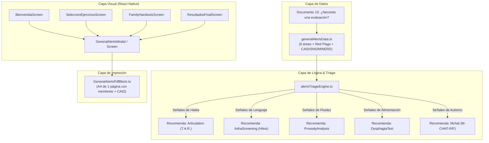

# Plan de Integración: Guía Rápida Integral de Señales de Alerta por Área en VIA+

## Goal Description
Integrar en la plataforma médica **VIA+** (rama `miguelina`) el documento maestro de cribado y orientación familiar: **«¿Necesito una evaluación? — Guía rápida de señales de alerta por área»** (código de catálogo `15`), basado en los estándares clínicos de la **American Speech-Language-Hearing Association (ASHA)** y contextualizado a los recursos sanitarios de **República Dominicana** (CAID, SNS, MINERD).

A diferencia de las guías específicas por edad o tema, este documento actúa como una **Matriz de Alerta Integral (Triage Clínico)** que consolida en un solo lugar las 6 áreas fundamentales del neurodesarrollo y la comunicación pediátrica:
1. 🗣️ **Habla (articulación)**: Inteligibilidad a los 3 años, omisiones/sustituciones a los 4 años y esfuerzo motor.
2. 💬 **Lenguaje (vocabulario y oraciones)**: Vocabulario < 50 palabras a los 2 años, oraciones a los 3 años y comprensión verbal.
3. ⏱️ **Fluidez (tartamudez)**: Tensión física, bloqueos espasmódicos y evitación por más de 6 meses.
4. 👥 **Comunicación social**: Interacción con iguales a los 4 años, turnos conversacionales y comprensión no literal.
5. 🥣 **Alimentación (deglución y selectividad)**: Atragantamientos frecuentes, rechazo de texturas y sialorrea > 2 años.
6. 🧩 **Autismo (comunicación y conducta)**: Respuesta al nombre a los 12 meses, regresión de habilidades y juego repetitivo.
7. 💡 **Confianza parental y rutas de derivación**: Principio de intervención precoz ("no esperar a ver si se le pasa") y mapa de centros en República Dominicana (CAID, SNS, Ministerio de Educación).

---

## User Review Required

> [!IMPORTANT]
> **Decisiones de Diseño y Funcionalidad:**
> 1. **Doble Modalidad (Lectura vs. Checklist Interactivo)**:
>    - **Modo 1 (Ficha para la Familia)**: Vista informativa y limpia para educar a los padres sobre cuándo consultar.
>    - **Modo 2 (Checklist de Triage Previo)**: Permite a los padres o al facultativo marcar interactivamente qué señales presenta el paciente. Al marcar señales de un área (ej. *Alimentación* o *Autismo*), el sistema sugiere directamente iniciar la prueba correspondiente en VIA+ (`DysphagiaTest`, `Mchat`, etc.).
> 2. **Ubicación en la Navegación**:
>    - Acceso como **Ficha Maestra Destacada** dentro de la biblioteca de Guías Familiares (`FamilyHandoutsScreen`).
>    - Acceso directo desde la pantalla de **Bienvenida (`BienvenidaScreen`)** mediante un botón sutil para padres o cuidadores: *«¿Dudas sobre el desarrollo? Guía de alertas»*.
>    - Acceso desde **Resultados Finales (`ResultadosFinalScreen`)** como hoja complementaria para adjuntar al informe médico.
> 3. **Exportación en PDF**:
>    - Renderizado en formato póster/tríptico A4 de 1 página con diseño visual limpio, logos oficiales de VIA+, membrete profesional y mapa de recursos institucionales en RD.

---

## Open Questions

> [!NOTE]
> 1. **Interoperabilidad con el Hub**: Si el usuario marca alertas en el checklist interactivo, ¿deseas que VIA+ resalte automáticamente en el Hub (`SeleccionEjerciciosScreen`) los módulos recomendados con un badge especial de *«Sugerido por signos de alerta»*?
> 2. **Teléfonos de Contacto Institucional RD**: ¿Deseas incluir en la ficha PDF los datos de contacto y sedes exactas del CAID (Santo Domingo Oeste, San Juan, Santiago) y del SNS?

---

## Architecture & System Integration



---

## Proposed Changes

### Component 1: Data Model & Clinical Catalog

#### [NEW] `src/Data/FamilyHandouts/generalAlertsData.ts`
- Definición de tipos estructurados para las 6 áreas de alerta:
  ```typescript
  export type AlertAreaKey = 'speech' | 'language' | 'fluency' | 'social' | 'feeding' | 'autism';

  export interface AlertAreaItem {
    id: string;
    text: string;
    ageHint?: string;
    severity: 'moderate' | 'high';
  }

  export interface AlertAreaDef {
    key: AlertAreaKey;
    title: string;
    icon: string;
    color: string;
    softColor: string;
    recommendedModuleId: keyof RootStackParamList;
    recommendedModuleName: string;
    items: AlertAreaItem[];
  }

  export interface InstitutionContactRD {
    name: string;
    acronym: string;
    description: string;
    coverage: string;
    targetAges: string;
  }

  export interface GeneralAlertsGuide {
    id: 'general_alerts_guide_15';
    title: string;
    subtitle: string;
    intro: string;
    areas: AlertAreaDef[];
    parentInstinctGuidance: string[];
    referralInstitutionsRD: InstitutionContactRD[];
    apaReference: string;
    ashaSourceUrl: string;
  }
  ```
- Constante tipada e inmutable `GENERAL_ALERTS_GUIDE` con todos los datos clínicos del documento en UTF-8, integrando las 3 entidades clave en República Dominicana (CAID, SNS, MINERD).

---

### Component 2: Triage Engine

#### [NEW] `src/Data/FamilyHandouts/alertsTriageEngine.ts`
- Función determinista sin dependencias externas:
  ```typescript
  export interface TriageResult {
    selectedCountByArea: Record<AlertAreaKey, number>;
    hasAnyAlerts: boolean;
    recommendedModules: Array<keyof RootStackParamList>;
    requiresUrgentEvaluation: boolean;
    summaryText: string;
  }

  export function computeAlertsTriage(selectedItemIds: string[]): TriageResult;
  ```

---

### Component 3: UI Screen & Interactive Modal

#### [NEW] `src/Screens/FamilyHandouts/GeneralAlertsScreen.tsx`
- Pantalla / vista interactiva con diseño de tableta y teléfono:
  - Selector de modo: **«Guía Informativa»** / **«Autoevaluación Familiar»**.
  - 6 tarjetas visuales para las 6 áreas (Habla, Lenguaje, Fluidez, Social, Alimentación, Autismo) con diseño de micro-chips y colores clínicos de VIA+.
  - Sección inferior destacada:
    - Tarjeta dorada: *«Confíe en su instinto: una sola señal ya amerita consultar»*.
    - Directorio institucional para República Dominicana con logos y badges de CAID, SNS y MINERD.
  - Botón de acción principal: **«Descargar Ficha Imprimible (PDF)»**.

#### [MODIFY] `src/Screens/FamilyHandouts/FamilyHandoutsScreen.tsx`
- Destacar la Guía 15 como la tarjeta de apertura ("Ficha Maestra: Señales de Alerta por Área") en la cabecera de la biblioteca familiar.

---

### Component 4: Navigation & Hub Integration

#### [MODIFY] `src/Navigators/screenTypeNavigator.ts`
- Añadir parámetros tipados para abrir la guía con modo de triage o lectura:
  ```typescript
  GeneralAlerts: { mode?: 'read' | 'triage'; referrer?: string } | undefined;
  ```

#### [MODIFY] `src/Navigators/Default.tsx`
- Registrar la ruta `GeneralAlerts` en el stack de navegación.

#### [MODIFY] `src/Screens/Bienvenida/BienvenidaScreen.tsx`
- Agregar acceso en el pie o barra superior: botón con icono de estetoscopio/alerta *«Guía de Señales de Alerta»*.

---

### Component 5: PDF Generation (1-Page High-Density Clinical Handout)

#### [NEW] `src/PDF/blocks/GeneralAlertsBlock.ts`
- Bloque `pdf-lib` vectorial optimizado para una sola página A4 (o Letter):
  - Encabezado: Logotipo oficial de VIA+, datos del profesional y fecha de emisión.
  - Parrilla 2 columnas x 3 filas con los 6 dominios clínicos, iconos vectoriales y viñetas de alerta.
  - Bloque inferior dividido:
    - Izquierda: Caja clínica *«Confíe en su instinto — Entre más pronto, mejor»*.
    - Derecha: Directorio de derivación en República Dominicana (CAID, SNS, MINERD).
  - Pie de página: Cita formal APA ASHA y atribución clínica.

#### [NEW] `src/PDF/templates/GeneralAlertsReport.ts`
- Función `generateGeneralAlertsPdf(options?: EvaluatorOptions): Promise<Uint8Array>`.

---

### Component 6: Automated Tests

#### [NEW] `src/Data/FamilyHandouts/__tests__/generalAlertsData.test.ts`
- Comprobación unitaria de la estructura:
  - Validación de las 6 áreas clínicas y sus ítems de alerta.
  - Validación de las instituciones de República Dominicana (CAID, SNS, MINERD).
  - Validación de URLs y citas bibliográficas ASHA.

#### [NEW] `src/Data/FamilyHandouts/__tests__/alertsTriageEngine.test.ts`
- Pruebas del motor de triage:
  - Verificación de recomendación de `DysphagiaTest` cuando se marcan ítems de alimentación.
  - Verificación de recomendación de `Mchat` cuando se marcan ítems de autismo.
  - Verificación de recomendación de `Articulation` cuando se marcan ítems de habla.

---

## Verification Plan

### Automated Tests
1. Ejecutar pruebas unitarias de la guía general y del motor de triage:
   ```bash
   npm test -- --testPathPattern=generalAlerts
   ```
2. Ejecutar la suite completa del proyecto para garantizar ausencia de regresiones:
   ```bash
   npm test
   ```
3. Verificación de compilación y tipado TypeScript estricto:
   ```bash
   npx tsc --noEmit
   ```

### Manual Verification
1. Abrir la pantalla `GeneralAlertsScreen` y comprobar:
   - Visualización correcta de las 6 áreas clínicas en tableta y móvil.
   - Funcionamiento del modo de selección interactiva (checklist).
   - Generación de las recomendaciones hacia los módulos correspondientes de VIA+.
2. Generar el PDF oficial y verificar:
   - Ajuste perfecto a una sola página A4 sin desbordamientos de texto.
   - Presencia de datos de cabecera, directorio de República Dominicana y cita APA de ASHA.
