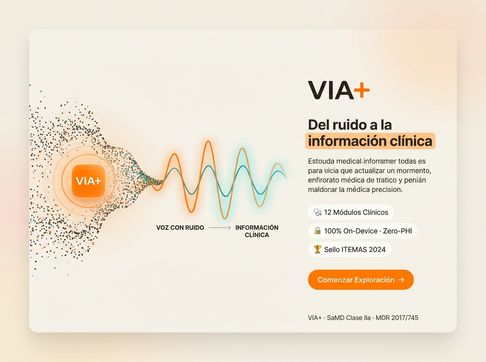
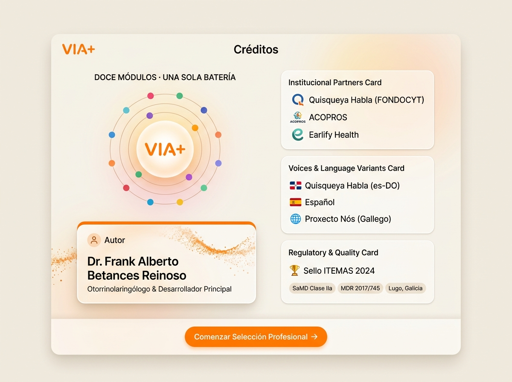

# Especificaciones de Diseño · Pantallas de Inicio y Créditos (VIA+)

Este documento recopila las referencias visuales aprobadas para las pantallas de **Inicio / Bienvenida** y **Créditos** en formato tableta horizontal (4:3), con su paleta de color oficial y distribución panorámica de dos columnas.

---

## 1. 🌅 Pantalla de Inicio / Bienvenida (`BienvenidaScreen`)

### Render Visual Aprobado:

### Estructura de la Pantalla:
1. **Columna Izquierda (Escenario Cinematográfico de Partículas)**:
   - Enjambre de partículas sonoras que entran caóticas por la izquierda (`VOZ CON RUIDO`), atraviesan el isotipo iluminado `VIA+` con anillos de pulso y emergen a la derecha como una onda senoidal armónica en naranja y turquesa (`INFORMACIÓN CLÍNICA`).
2. **Columna Derecha (Propuesta de Valor y Acción Principal)**:
   - Logotipo `VIA+`.
   - Titular: **`Del ruido a la información clínica`** con acento naranja.
   - Párrafo explicativo sobre el procesamiento objetivo de la señal acústica.
   - 3 tarjetas de valor:
     - 🩺 `12 Módulos Clínicos`
     - 🔒 `100% On-Device · Zero-PHI`
     - 🏆 `Sello ITEMAS 2024`
   - Botón ergonómico en Naranja Radiante (`#FF7F00`): **`Comenzar Exploración →`**.

---

## 2. 🏛️ Pantalla de Créditos (`CreditosScreen`)

### Render Visual Aprobado:

### Estructura de la Pantalla:
1. **Columna Izquierda (Identidad y Autoría)**:
   - **Emblema Central de Órbita**: Isotipo `VIA+` rodeado de 12 puntos de colores correspondientes a cada uno de los 12 módulos de la batería girando en órbitas elípticas vivas (`DOCE MÓDULOS · UNA SOLA BATERÍA`).
   - **Tarjeta de Autoría** (`AUTORÍA Y DIRECCIÓN CLÍNICA`): Tarjeta blanca con raíl naranja y corriente de partículas ordenadas, con el sello y crédito al **`Dr. Frank Alberto Betances Reinoso`** *(Otorrinolaringólogo y desarrollador principal)*.
2. **Columna Derecha (Alianzas, Voces y Calidad)** — rótulos en castellano, nunca los marcadores del mockup en inglés:
   - **`COLABORADORES`**: *Quisqueya Habla (FONDOCYT)*, *ACOPROS* y *Earlify Health*.
   - **`VOCES Y LENGUAJES`**: *Quisqueya Habla (es-DO)*, *Español (España)*, *Proxecto Nós · ILENIA*, y la atribución de los motores abiertos *Piper* y *eSpeak NG*.
   - **`CALIDAD Y NORMATIVA`**: *Sello ITEMAS 2024*, chips de marcado regulatorio *SaMD Clase IIa*, *MDR 2017/745*, *Lugo, Galicia*.
3. **Dock Inferior**:
   - Botón principal de avance: **`Comenzar Selección Profesional →`**.
