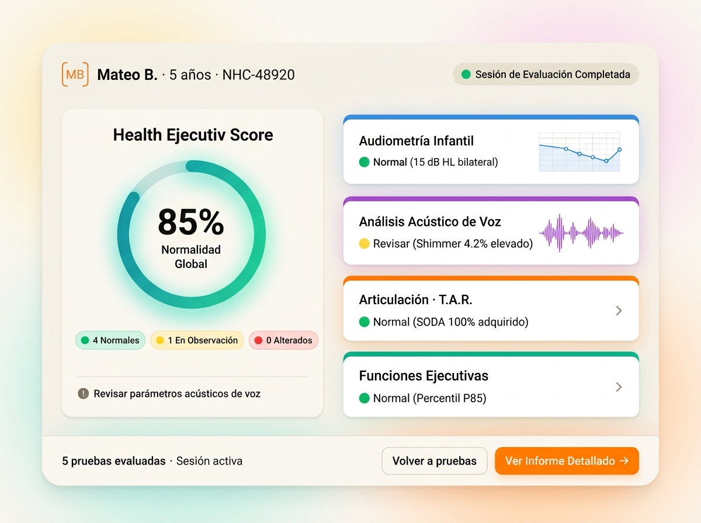
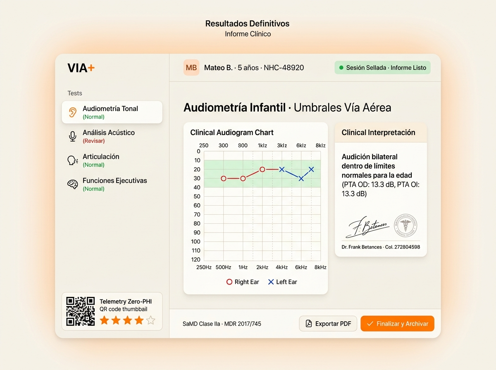

# Especificaciones de Diseño · Resultados Preliminares y Definitivos (VIA+)

Este documento recopila las referencias visuales aprobadas para las pantallas de **Resultados Preliminares** y **Resultados Definitivos / Informe Clínico** en formato tableta apaisada (4:3) con Master-Detail y gráficos clínicos interactivos.

---

## 1. 📊 Pantalla de Resultados Preliminares (`ResultadosPreliminaresScreen`)

### Render Visual Aprobado:

### Estructura de la Pantalla:
1. **Columna Izquierda (Medidor de Salud Global)**:
   - **Anillo de Score Visual (85%)**: Gradiente verde menta a teal que sintetiza el porcentaje global de normalidad de la batería.
   - **Semáforo Diagnóstico**: Chips con conteo de `4 Normales`, `1 En Observación` y `0 Alterados`.
   - **Alerta Clínica Resumida**: Recomendación rápida (*"Revisar parámetros acústicos de voz"*).
2. **Columna Derecha (Rejilla de Pruebas Evaluadas)**:
   - Tarjetas con **raíl lateral de dominio** (*Azul para audición, Púrpura para voz, Naranja para TAR, Esmeralda para ejecutivas*).
   - Micro-curvas y gráficos integrados (audiograma, espectrograma).
   - Métricas clave en texto claro (e.g. *15 dB HL bilateral*, *Shimmer 4.2% elevado*).
3. **Dock Inferior**:
   - Resumen de sesión a la izquierda y botón en Naranja Radiante **`Ver Informe Detallado →`** a la derecha.

---

## 2. 📋 Pantalla de Resultados Definitivos / Informe Clínico (`ResultadosFinalScreen`)

### Render Visual Aprobado:

### Estructura de la Pantalla (Master-Detail):
1. **Barra Lateral Izquierda (Master Navigation Sidebar)**:
   - Lista de pruebas completadas con sus badges de estado (`Normal`, `Revisar`).
   - Módulo inferior de **Telemetría Zero-PHI** con escala de satisfacción Likert (1 a 5 estrellas) y código QR comprimido.
2. **Escenario Principal Derecho (Clinical Detail Stage)**:
   - **Audiograma Gráfico Clínico de Alta Definición**: Curvas OD (🔴 Círculos) y OI (🔵 Cruces) sobre la franja sombreada de normalidad (<20 dB HL) y frecuencias de 250 Hz a 8 kHz.
   - **Tarjeta de Interpretación Médica**: Juicio clínico objetivo con cálculo automático del Promedio Tonal Puro (PTA).
   - **Sello y Firma Médica**: Validado por el facultativo colegiado (*Dr. Frank Betances*).
3. **Dock Inferior de Cierre**:
   - Botón de descarga de informe oficial **`📄 Exportar PDF`** y botón en Naranja Radiante **`✅ Finalizar y Archivar`**.
