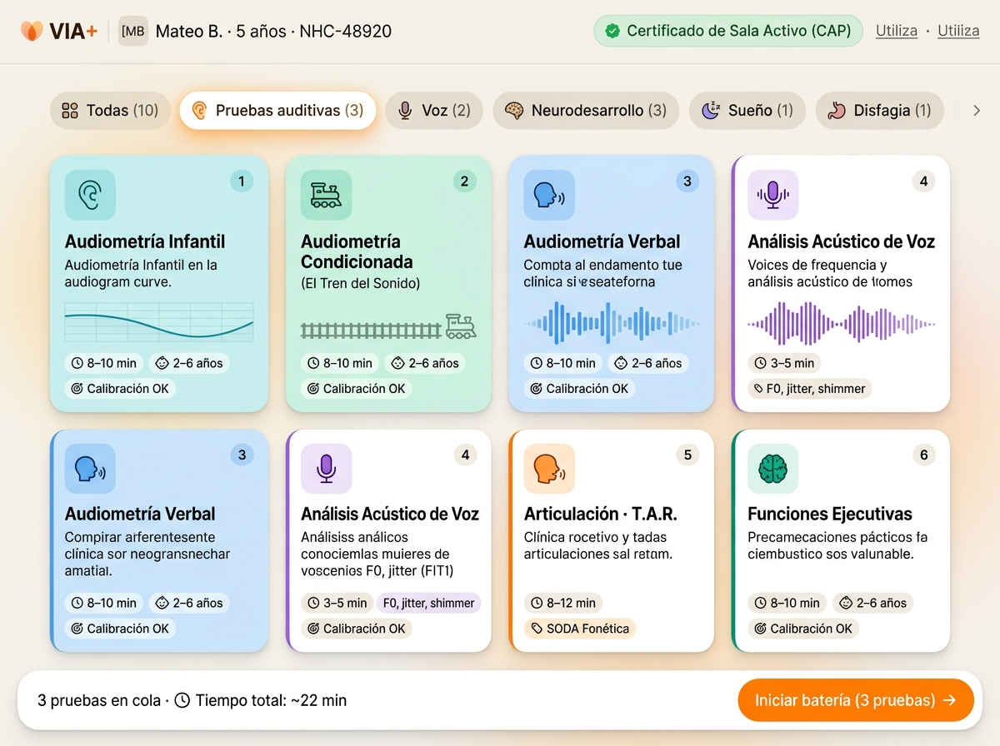

# Especificación de Diseño Visual · Pantalla de Selección de Pruebas (VIA+)

Este documento contiene la **referencia visual aprobada** para la pantalla de selección de pruebas en formato tableta apaisada (4:3), con su paleta de color, estructura y componentes enriquecidos.

---

## 🖼️ Render de Referencia Aprobado

---

## 🎨 1. Sistema de Color y Lienzo (Brand VIA+)

- **Fondo de Pantalla**: Crema cálido aterciopelado (`#F5F2EC` / `#ECE7DE`) con manchas difusas `RadialBackground` en las esquinas.
- **Color Primario de Acción**: Naranja Radiante VIA (`#FF7F00` / `#F0AE6C`).
- **Textos**: Carbón oscuro cálido (`#2B2620`) para títulos, neutro secundario (`#64748B`) para descripciones.
- **Dominios Clínicos (Colores de Acento y Fondos Suaves)**:
  - 🟣 **Voz**: Acento `#7C3AED` | Fondo suave `#F3E8FF`
  - 🔵 **Audición (Infantil / Condicionada / Verbal)**: Acento `#0284C7` / `#0D9488` / `#2563EB` | Fondo suave `#E0F2FE` / `#CCFBF1`
  - 🟠 **Lenguaje / T.A.R.**: Acento `#EA580C` | Fondo suave `#FFEDD5`
  - 🟢 **Funciones Ejecutivas / Cognición**: Acento `#059669` | Fondo suave `#D1FAE5`
  - 🔴 **Disfagia**: Acento `#DC2626` | Fondo suave `#FEE2E2`
  - 🔵 **Sueño**: Acento `#4F46E5` | Fondo suave `#E0E7FF`

---

## 📐 2. Estructura de la Pantalla (Tableta 4:3)

### A. Cabecera del Paciente (Zero-PHI)
- **Monograma de Iniciales**: Píldora naranja cálida con `[MB]`.
- **Datos Clínicos**: `Mateo B. · 5 años · NHC-48920`.
- **Estado Ambiental**: `🟢 Certificado de Sala Activo (CAP)`.
- **Accesos Rápidos**: `Volver al CAP` y `Sonómetro de sala`.

### B. Barra de Filtros con Insignias Vectoriales Multicapa
Carrusel horizontal con 6 categorías ilustradas:
1. `Todas (10)`
2. `Pruebas auditivas (3)` *(Auriculares acústicos + ondas sonoras)*
3. `Voz (2)` *(Micrófono clínico + espectrograma)*
4. `Neurodesarrollo (3)` *(Cerebro sináptico + pieza de puzzle)*
5. `Sueño (1)` *(Luna dorada + nube + estrellas)*
6. `Disfagia (1)` *(Gotícula de deglución + sensor SpO2)*

### C. Rejilla de Tarjetas Clínicas Enriquecidas (2 Columnas)
Cada tarjeta contiene:
1. **Raíl lateral izquierdo** del color del dominio.
2. **Azulejo con icono temático** en la esquina superior izquierda.
3. **Título en negrita** + badge del dominio + badge de orden secuencial (`#1`, `#2`, `#3`) al seleccionarse.
4. **Descripción clínica concisa** (2 líneas).
5. **Micro-gráfica / Ilustración central temática** (mini curva de audiograma, vía de tren del sonido, espectrograma de voz, ondas de habla o red sináptica).
6. **Fila inferior de metadatos**:
   - ⏱️ `Duración` (e.g. `8–10 min`)
   - 👶 `Edad diana` (e.g. `2–6 años`)
   - 🎯 `Validación / Parámetro` (e.g. `Calibración OK`, `F0, jitter`, `SODA Fonética`)

### D. Dock Inferior Flotante (Sticky Action Dock)
- **Izquierda**: Conteo de pruebas en cola y tiempo estimado acumulado (`3 pruebas en cola · ⏱️ Tiempo total: ~22 min`).
- **Derecha**: Botón de inicio en Naranja Radiante (`#FF7F00`): **`Iniciar batería (3 pruebas) →`**.

---

## 💻 Archivos de Implementación Relacionados
- [`via/src/Screens/SeleccionEjercicios/CategoryBadgeIcon.tsx`](../src/Screens/SeleccionEjercicios/CategoryBadgeIcon.tsx)
- [`via/src/Screens/SeleccionEjercicios/CategoryFilterChip.tsx`](../src/Screens/SeleccionEjercicios/CategoryFilterChip.tsx)
- [`via/src/Screens/SeleccionEjercicios/ModuleCardItem.tsx`](../src/Screens/SeleccionEjercicios/ModuleCardItem.tsx)
- [`via/src/Screens/SeleccionEjercicios/SeleccionEjerciciosScreen.tsx`](../src/Screens/SeleccionEjercicios/SeleccionEjerciciosScreen.tsx)
