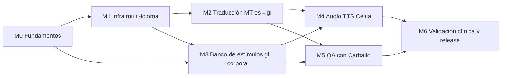

# Plan de trabajo — Integración del Proxecto Nós (versión en gallego)

> **Estado:** PLAN DE REFERENCIA (v1). Documento maestro para la integración
> escalonada de los recursos del [Proxecto Nós](https://github.com/proxectonos)
> en VIA+ con el objetivo de ofrecer la batería de ejercicios en gallego.
> **Alcance regulatorio:** añadir idioma a un SaMD Clase IIa (MDR 2017/745) es
> un cambio controlado — cada módulo de este plan termina en un entregable
> verificable y ningún contenido generado por IA llega a uso clínico sin
> revisión humana firmada.
> **Principio rector:** los modelos del Nós se usan como **herramientas de
> desarrollo** (generación de contenido en build-time); la app no incorpora
> ninguna dependencia de IA en runtime y sigue siendo offline-first.
> **Documento hermano:** `integracion-quisqueya-habla.md` (variante es-DO ·
> Quisqueya Habla); el módulo M1 de este plan es infraestructura compartida y
> debe diseñarse para `es | gl | es-DO` desde el inicio.

---

## Recursos del Proxecto Nós que se integran

| Recurso | Modelo/Repo | Rol en VIA+ | Módulo |
|---|---|---|---|
| Traducción es→gl | [`proxectonos/Nos_MT-OpenNMT-es-gl`](https://huggingface.co/proxectonos/Nos_MT-OpenNMT-es-gl) | Borrador de catálogos i18n `gl` (UI, consignas, PDF) | M2 |
| Corpus del gallego | [`proxectonos/corpora`](https://github.com/proxectonos/corpora) | Selección léxica del banco de estímulos gallego | M3 |
| TTS Celtia (VITS/Coqui) | [`proxectonos/Nos_TTS-celtia-vits-graphemes`](https://huggingface.co/proxectonos/Nos_TTS-celtia-vits-graphemes) | Locuciones provisionales `gl` + consignas empaquetadas | M4 |
| LLM Carballo | [`proxectonos/language-models`](https://github.com/proxectonos/language-models) | QA lingüístico asistido y redacción de borradores | M5 |

## Mapa de dependencias

M1 y M3 pueden avanzar **en paralelo** tras M0: M1 es trabajo de código puro y
M3 es el camino crítico (requiere logopeda). M5 es transversal y opcional para
el release: aporta calidad, no funcionalidad.

---

## M0 · Fundamentos y tooling (pre-requisito, ~2–3 días)

**Objetivo:** entorno reproducible para ejecutar los modelos del Nós fuera de
la app y decisiones de base documentadas.

| Task | Descripción | Done cuando… |
|---|---|---|
| T0.1 | Crear `tools/nos/` con entorno Python aislado (`requirements.txt` fijando versiones: `ctranslate2`/`OpenNMT-py` para MT, `coqui-tts` para VITS) y `README.md` de uso | `pip install -r` + smoke test de cada modelo funcionan en una máquina limpia |
| T0.2 | Auditoría de licencias: ficha de cada modelo usado (MIT/Apache/CC), qué permite empaquetar (audio generado, textos traducidos) y registro en `docs/design/integracion-proxecto-nos-licencias.md` | Tabla de licencias revisada y sin bloqueantes para app propietaria |
| T0.3 | Decisión de variante normativa del gallego (RAG) y guía de estilo breve para revisores (tratamiento, terminología clínica gl) | Media página acordada con el revisor lingüístico |
| T0.4 | Descarga y cacheo local de los 4 recursos (pesos MT, voz Celtia, corpus, Carballo) con checksums anotados | Script `tools/nos/fetch-models.sh` idempotente |

**Entregable:** `tools/nos/` operativo + doc de licencias. **Riesgo a vigilar:**
tamaño/formato de pesos y compatibilidad de versiones de Coqui TTS.

---

## M1 · Infraestructura multi-idioma en la app (~1 semana, paralelizable con M3)

**Objetivo:** que la app soporte `gl` estructuralmente, sin contenido aún.
Todo es código determinista y testeable; ningún modelo del Nós interviene.

| Task | Descripción | Done cuando… |
|---|---|---|
| T1.1 | Registrar `gl` en i18n: `src/I18n/locales/gl/` (inicialmente copia de `es` marcada `PENDENTE`), `I18N_RESOURCES` y `DEFAULT_LANGUAGE` parametrizable | `initI18n('gl')` arranca y hace fallback correcto a `es` |
| T1.2 | Extender `i18nCatalog.test.ts` a paridad es/en/gl (mismas claves y placeholders `{{...}}`) | CI rompe si un idioma diverge |
| T1.3 | Parametrizar el banco verbal por idioma: `verbalAudiometryLists.ts` → `verbalAudiometryLists.es.ts` + selector `getVerbalBands(lang)`; ids de ítem con espacio propio por idioma (estables, sin colisión con `es`) | Tests existentes verdes con `es`; API lista para `gl` |
| T1.4 | Espacio de nombres de assets por idioma: `assets/audio/verbal/<lang>/…`, `assets/img/verbal/<lang>/…`; `assetKeyForWord` revisada para grafemas gl (ñ→ny ya cubierto; revisar apóstrofos y guiones: «pé», «bóla» normalizan sin colisión) | `verbalAssets.test.ts` valida inventario por idioma |
| T1.5 | `scripts/verbal-assets.js --lang <es\|gl>`: manifiesto, registro e inventario por idioma (fuente única `collectAssetInventory(lang)`) | `manifest`/`registry` generan salidas separadas por idioma sin tocar las de `es` |
| T1.6 | Selector de idioma de la sesión de evaluación (UI en `SeleccionEjercicios` o ajustes) persistido con la evaluación, y `efSpeech`/audiometría leen el idioma activo | El idioma queda registrado en la evaluación y en el PDF |

**Entregable:** app bilingüe estructural (con `gl` = placeholder) mergeable a
main sin cambio de comportamiento para `es`.

---

## M2 · Traducción de catálogos con Nos_MT-OpenNMT-es-gl (~3–4 días + revisión)

**Objetivo:** catálogos `gl` completos con trazabilidad borrador-MT → revisión
humana. La MT **nunca** se ejecuta en la app ni publica texto sin revisar.

| Task | Descripción | Done cuando… |
|---|---|---|
| T2.1 | `tools/nos/translate-catalog.py`: lee `locales/es/*.json`, traduce valor a valor preservando claves y placeholders `{{...}}`, emite `locales/gl/*.json` + informe de segmentos dudosos | Round-trip sin pérdida de claves/placeholders (test unitario del script) |
| T2.2 | Protección de términos: glosario no-traducible (marca VIA+, unidades dB/Hz, términos clínicos acordados en T0.3) aplicado pre/post MT | Glosario respetado en el 100 % de los segmentos |
| T2.3 | Ciclo de revisión humana: exportar borrador a hoja revisable (es / gl-MT / gl-final / comentario), incorporar correcciones y marcar el catálogo `reviewed: true` en metadatos | Todos los namespaces revisados y firmados por revisor lingüístico |
| T2.4 | Traducir también los bloques PDF y textos legales (consentimiento) — estos con revisión **jurídica** además de lingüística | PDF de informe generado íntegramente en gl |

**Entregable:** `src/I18n/locales/gl/` real y firmado; el test de paridad de
T1.2 pasa sin exclusiones.

---

## M3 · Banco de estímulos gallego con `corpora` (camino crítico, ~3–4 semanas con logopeda)

**Objetivo:** banco de audiometría verbal **diseñado para la fonología del
gallego**, no traducido. Es el módulo que marca la fecha del release.

> ⚠️ Los pares mínimos españoles («boca/foca», «peso/beso») miden
> discriminación fonética del español; el banco gl debe construirse sobre los
> contrastes propios del gallego (vocales medias /ɛ/–/e/ y /ɔ/–/o/
> («óso/oso», «bóla/bola»), nasal velar «unha», seseo/gheada según variante,
> etc.) y validarse igual que exige `validacion-clinica-verbal.md` para `es`.

| Task | Descripción | Done cuando… |
|---|---|---|
| T3.1 | Extraer de `proxectonos/corpora` un léxico de frecuencias apto para vocabulario infantil (script `tools/nos/build-lexicon.py`, salida CSV palabra/frecuencia/sílabas) | Léxico de ≥5k lemas con métricas por franja de edad aproximada |
| T3.2 | Generar **candidatos** de láminas por banda A–D: filtrado por longitud silábica, frecuencia y vecindad fonética (Levenshtein sobre transcripción) replicando los invariantes de `verbalAudiometryValidation.test.ts` | Lista de candidatos por banda que pasa los invariantes de máquina |
| T3.3 | Sesiones de diseño con logopeda gallego-hablante: selección final, pares mínimos clínicamente relevantes, decisión sobre variantes dialectales | Banco A–D firmado en `docs/design/audiometria-verbal-gl.md` |
| T3.4 | Codificar `verbalAudiometryLists.gl.ts` + extender la suite de validación CI al banco gl (mismos invariantes; umbrales silábicos revisados si procede) | CI verde con ambos bancos |
| T3.5 | Ilustraciones: mapear qué imágenes de `es` son reutilizables (mismo concepto) y encargar/generar las nuevas provisionales con el pipeline existente | Inventario de imágenes gl completo en el manifiesto |

**Entregable:** banco gl validado estructuralmente en CI y firmado en diseño
(la firma clínica final llega en M6).

### Estado actual de M3

**T3.3 y T3.4 hechos. El banco gallego está APROBADO por ACOPROS**
(28-07-2026), registro en `assets/verbal-approval.gl.json` y contenido firmado
en [`audiometria-verbal-gl.md`](./audiometria-verbal-gl.md).

`verbalAudiometryLists.gl.ts` está registrado en `verbalAudiometryBanks.ts`, el
gallego aparece en el selector de lengua de la audiometría verbal y la suite
`verbalAudiometryValidation.test.ts` corre los **mismos invariantes sobre todos
los bancos registrados** (`describe.each(VERBAL_BANK_LANGS)`), de modo que el
banco gallego no puede degradarse sin romper CI.

El contenido se construyó sobre rasgos propios del gallego —«x» /ʃ/
(xerra, xeso, queixo, fixo), diptongos decrecientes «ou»/«ei» (lousa, vasoira,
bandeira), /ʎ/ y /ɲ/ (abella/ovella, piño/viño) y oxítonas en -á (ventá, mazá,
campá)— y **no** por traducción del banco castellano, que habría destruido los
pares mínimos.

Lo que **falta** para cerrar el gallego:

- **T3.1/T3.2**: la selección léxica se firmó sin anclar a las frecuencias de
  `proxectonos/corpora`. No invalida el banco aprobado; queda como trabajo de
  refuerzo metodológico si se quiere justificar la elección con datos de
  corpus.
- **T3.5**: sin ilustraciones propias. Hoy 50 de 101 claves de imagen se
  heredan del castellano por coincidencia de palabra; el resto cae a
  pictograma o a tile de inicial.
- **M4 (audio Celtia): PENDIENTE y es lo que bloquea el uso diagnóstico.** No
  hay recortes `gl` empaquetados. El adaptador **no** sustituye por los
  castellanos —«ventá» dictado con el recorte de «ventana» sería otro
  estímulo— sino que degrada a la voz del dispositivo, prefiriendo una voz
  `gl-*` si existe y declarando la caída a voz castellana cuando no
  (`pickVoiceForLang`). El idioma está en `VERBAL_AUDIO_PENDING` y la pantalla
  lo advierte.

> La firma del BANCO no arrastra la del AUDIO: son artefactos distintos, con
> registros de aprobación separados (`scope: "bank"` / `scope: "audio"`) y
> banderas distintas en código. Cuando M4 sintetice las locuciones hará falta
> un registro nuevo con `scope: "audio"` y la checklist de escucha de T4.4.

---

## M4 · Locuciones con TTS Celtia (VITS/Coqui) (~1 semana)

**Objetivo:** audio gallego provisional de calidad para pilotos técnicos,
generado con la voz Celtia; la producción clínica final (locutor profesional)
sustituye archivo a archivo sin tocar código, igual que en `es`.

| Task | Descripción | Done cuando… |
|---|---|---|
| T4.1 | `tools/nos/tts-celtia.py`: texto → WAV con `Nos_TTS-celtia-vits-graphemes` (Coqui), parámetros fijados (sample rate, velocidad) | Locución reproducible y determinista para una misma entrada |
| T4.2 | Integrar en `scripts/verbal-assets.js audio --lang gl`: invoca T4.1 en lugar de espeak-ng, conserva post-proceso ffmpeg (`loudnorm`, recorte de silencios, `.m4a`) y contrato de claves | `assets/audio/verbal/gl/` completo según inventario; manifiesto sin huecos |
| T4.3 | Consignas habladas empaquetadas: generar con Celtia las consignas de funciones ejecutivas y demás módulos (desde catálogo `gl` revisado de M2) como assets, y hacer que `efSpeech.ts` use audio empaquetado cuando el dispositivo no tenga voz `gl-ES` (degradación silenciosa actual como último escalón) | Consignas suenan en gl en dispositivos sin voz gallega del sistema |
| T4.4 | QA acústico: escucha completa del banco por hablante nativo + verificación de sonoridad homogénea entre `es` y `gl` (mismo objetivo LUFS) | Checklist de escucha firmada; ningún ítem ininteligible |

**Entregable:** paquete de audio gl provisional completo y normalizado,
marcado `provisional: true` en el manifiesto como hoy en `es`.

---

## M5 · QA lingüístico con Carballo (transversal, opcional para release, ~2–3 días)

**Objetivo:** usar el LLM gallego como **asistente de calidad**, nunca como
autor final. Todo output de Carballo pasa por el mismo ciclo de revisión
humana que la MT.

| Task | Descripción | Done cuando… |
|---|---|---|
| T5.1 | `tools/nos/qa-carballo.py`: pasada de revisión sobre los catálogos gl (naturalidad, registro, concordancia) que emite sugerencias diff-style para el revisor | Informe de sugerencias generado sobre el catálogo completo |
| T5.2 | Contraste MT↔LLM: señalar segmentos donde Carballo discrepa fuerte del borrador MT como «dudosos» prioritarios para el revisor de T2.3 | Lista de segmentos dudosos integrada en la hoja de revisión |
| T5.3 | Borradores de textos nuevos solo-gl (p. ej. descripciones de láminas para el logopeda en T3.3) | Material de apoyo entregado al equipo clínico |

**Entregable:** herramienta de QA repetible para futuras iteraciones de
contenido (nuevos módulos, nuevas frases).

---

## M6 · Validación clínica, regulatoria y release (~2–3 semanas, mayormente no-código)

**Objetivo:** cerrar el ciclo SaMD para la variante gallega.

| Task | Descripción | Done cuando… |
|---|---|---|
| T6.1 | Extender `validacion-clinica-verbal.md` con el protocolo gl y obtener la firma del logopeda sobre banco, ilustraciones y cortes de interpretación | Documento firmado |
| T6.2 | Control de cambios IEC 62304: registro del cambio, análisis de riesgos ISO 14971 del nuevo idioma (riesgo principal: estímulo mal comprendido → resultado sesgado) y actualización del expediente técnico | Expediente actualizado |
| T6.3 | Piloto técnico en dispositivo real con hablantes gl (usabilidad de consignas, inteligibilidad de locuciones en campo libre) | Acta de piloto sin hallazgos bloqueantes |
| T6.4 | Sustitución de audio provisional por locutor profesional (si el piloto lo exige para release clínico) y regeneración del manifiesto con `provisional: false` | Manifiesto de producción |
| T6.5 | Release: idioma gl visible en la UI de selección, notas de versión y manual de usuario actualizado (`docs/manual/`) | Build de release con gl habilitado |

---

## Resumen de secuencia y esfuerzo

| Fase | Módulos | Duración orientativa | Puede empezar |
|---|---|---|---|
| 1 | M0 | 2–3 días | Ya |
| 2 | M1 ∥ M3 (inicio) | 1 semana / 3–4 semanas | Tras M0 |
| 3 | M2 | 3–4 días + revisión | Tras M1 |
| 4 | M4 | 1 semana | Tras M2 y M3 |
| 5 | M5 | 2–3 días (transversal) | Tras M2 |
| 6 | M6 | 2–3 semanas | Tras M4 |

**Camino crítico:** M0 → M3 (logopeda) → M4 → M6. El trabajo de ingeniería
(M1, M2, M4, M5) cabe holgadamente dentro del plazo de M3+M6, así que la
fecha la marcan las personas (logopeda y revisor lingüístico), no el código —
conviene agendar T3.3 y T2.3 cuanto antes.
