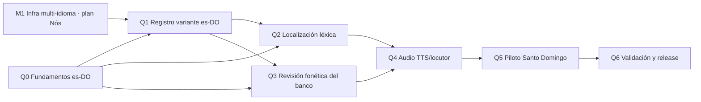

# Plan de trabajo — Quisqueya Habla (variante es-DO · Santo Domingo)

> **Estado:** PLAN DE REFERENCIA (v1). Documento maestro para la adaptación de
> la batería VIA+ al español dominicano («Quisqueya Habla»), hermano del plan
> gallego (`docs/design/integracion-proxecto-nos.md`). Ambos comparten la misma
> infraestructura multi-idioma (módulo M1 del plan Nós), que debe diseñarse
> desde el inicio para `es | gl | es-DO`.
> **Alcance regulatorio:** misma disciplina que el plan gallego — variante
> nueva de un SaMD Clase IIa (MDR 2017/745), cambio controlado IEC 62304, y
> ningún contenido generado por IA llega a uso clínico sin revisión humana
> firmada. Si el despliegue en República Dominicana sale del marco MDR,
> añadir el análisis regulatorio local (DIGEMAPS) en Q0.
> **Diferencia estructural con el plan gallego:** el dominicano es español —
> no hay traducción (desaparece el módulo MT) sino **localización de variante**
> (léxico + fonética caribeña), más ligera en ingeniería pero igual de crítica
> en lo clínico.

---

## Recursos abiertos que se integran

| Rol (equivalente en el plan Nós) | Recurso para es-DO | Módulo |
|---|---|---|
| LLM de apoyo (Carballo) | [LatamGPT](https://cenia.cl/2026/02/10/latam-gpt-la-primera-ia-regional-abierta-creada-con-datos-latinoamericanos/) (CENIA, abierto, base Llama 3.1 70B) + recursos de [Somos NLP](https://huggingface.co/somosnlp) | Q4 |
| Traducción MT (Nos_MT es-gl) | **No aplica** → glosario de variante es-DO con revisor dominicano | Q2 |
| Corpus (`proxectonos/corpora`) | Léxico disponible de la República Dominicana (Orlando Alba) · PRESEEA–Santo Domingo · CORPES XXI (zona Antillas) | Q3 |
| TTS (Celtia/VITS) | Voces abiertas Piper/VITS es_MX–es_AR como provisional ([rhasspy/piper-voices](https://huggingface.co/rhasspy/piper-voices)); **no existe voz abierta es-DO** → decisión en Q4 | Q4 |

## Mapa de dependencias

**Prerrequisito compartido:** M1 del plan Nós (parametrización de i18n, banco
y assets por idioma). Si M1 se implementa una vez para las tres variantes,
Quisqueya Habla no necesita infraestructura propia — solo contenido.

---

## Q0 · Fundamentos es-DO (~3–4 días)

**Objetivo:** decisiones de base y materiales de referencia antes de tocar
contenido.

| Task | Descripción | Done cuando… |
|---|---|---|
| Q0.1 | Marco regulatorio del despliegue en RD: confirmar si aplica MDR (uso UE), registro sanitario dominicano (DIGEMAPS) o ambos; registrar la decisión | Nota regulatoria firmada en el expediente |
| Q0.2 | Equipo de variante: logopeda/fonoaudiólogo dominicano y revisor lingüístico nativo identificados y agendados (son el camino crítico, como en gl) | Sesiones Q2.3 y Q3.3 en calendario |
| Q0.3 | Compilar el material léxico de referencia: léxico disponible de O. Alba, PRESEEA–Santo Domingo, CORPES XXI (Antillas); documentar acceso y licencia de cada fuente en `docs/design/integracion-quisqueya-habla-fuentes.md` | Fuentes accesibles y con licencia clarificada |
| Q0.4 | Guía de estilo es-DO (media página): tratamiento (tuteo dominicano), léxico preferente por franja de edad, qué rasgos dialectales se reflejan en texto y cuáles no | Guía acordada con el revisor |
| Q0.5 | Extender `tools/nos/` (T0.1 del plan gallego) con los recursos es-DO: voz Piper provisional descargada y LatamGPT accesible (API o pesos según infraestructura disponible) | Smoke test de TTS provisional y LLM |

**Entregable:** decisiones documentadas + tooling listo. **Riesgo a vigilar:**
las fuentes léxicas dominicanas no están «listas para pipeline» (papel/PDF);
Q0.3 debe estimar el coste de digitalizarlas antes de comprometer Q3.

---

## Q1 · Registro de la variante en la app (~2–3 días, tras M1)

**Objetivo:** que `es-DO` exista estructuralmente reutilizando la
infraestructura del plan Nós, con **herencia** del español base (a diferencia
de `gl`, que es idioma completo).

| Task | Descripción | Done cuando… |
|---|---|---|
| Q1.1 | Registrar `es-DO` en i18n como variante con fallback en cascada `es-DO → es` (i18next lo soporta nativamente): solo se sobreescriben las claves localizadas | `initI18n('es-DO')` resuelve mezcla variante+base correctamente |
| Q1.2 | Test de catálogo para variantes: toda clave presente en `es-DO` debe existir en `es` (subconjunto estricto, sin claves huérfanas ni placeholders divergentes) | CI rompe ante divergencia |
| Q1.3 | Banco de estímulos: `verbalAudiometryLists.es-DO.ts` registrado en `getVerbalBands(lang)` con espacio de ids propio; assets en `assets/audio/verbal/es-DO/` (las imágenes de `es` se heredan salvo sustitución explícita) | Selector de banda operativo con la variante; tests verdes |
| Q1.4 | `scripts/verbal-assets.js --lang es-DO` con manifiesto propio y reutilización declarada de assets heredados | Manifiesto distingue heredado/propio sin duplicar archivos |

**Entregable:** variante es-DO seleccionable en desarrollo, con contenido aún
igual al español base.

---

## Q2 · Localización léxica y de textos (~1 semana + revisión)

**Objetivo:** que consignas, UI y PDF suenen naturales a un niño y a un
clínico dominicanos. Sustituye al módulo MT del plan gallego.

| Task | Descripción | Done cuando… |
|---|---|---|
| Q2.1 | Glosario de variante es→es-DO (guagua, chichí, china, lechosa, funda…) construido con el revisor sobre el catálogo actual; almacenado como dato (`tools/nos/glosario-es-do.csv`), no hardcodeado | Glosario versionado y aplicable por script |
| Q2.2 | `tools/nos/localize-catalog.py`: aplica el glosario sobre `locales/es/*` y emite solo las claves que cambian (delta mínimo para el fallback de Q1.1), con informe de segmentos dudosos | Catálogo es-DO = delta limpio; round-trip sin pérdida de claves/placeholders |
| Q2.3 | Revisión humana firmada del delta (revisor nativo): naturalidad, registro pediátrico, coherencia con la guía Q0.4 | `reviewed: true` en todos los namespaces tocados |
| Q2.4 | Textos legales (consentimiento informado) adaptados al marco de Q0.1 con revisión jurídica local | Consentimiento es-DO firmado |

**Entregable:** `locales/es-DO/` real y firmado (delta sobre `es`).

---

## Q3 · Revisión fonética del banco de estímulos (camino crítico, ~2–3 semanas con logopeda)

**Objetivo:** banco verbal válido para la fonología dominicana. **No es un
banco desde cero** (a diferencia del gallego): es una auditoría y sustitución
selectiva del banco español.

> ⚠️ Rasgos del español caribeño que debilitan láminas actuales y que el
> logopeda debe auditar par a par:
> - **Seseo** (sin /θ/): contrastes que dependan de s/z-c pierden valor
>   discriminativo («loza/sosa» sigue siendo válido por /l/–/s/; «casa/caza»
>   no existiría como par).
> - **Aspiración/elisión de /s/ en coda**: pares que dependan de /s/ final o
>   implosiva son frágiles en campo libre.
> - **Neutralización /r/–/l/ en coda** (lambdacismo): «puerta/puelta» —
>   contrastes líquidos en coda no son fiables.
> - **Elisión de /d/ intervocálica** y debilitamiento de /x/ («j» suave).
> La lista final debe **estresar contrastes estables** en la variante (oclusivas
> sordas/sonoras en ataque, nasales, vocales) y evitar los inestables.

| Task | Descripción | Done cuando… |
|---|---|---|
| Q3.1 | Auditoría automática previa: script que marque en el banco actual toda lámina cuyo contraste dependa de /θ/, /s/ en coda o líquidas en coda (sobre transcripción fonológica es-DO simplificada) | Informe de láminas en riesgo por banda |
| Q3.2 | Familiaridad léxica: cruzar objetivos y distractores con el léxico disponible dominicano (Q0.3); marcar palabras de baja familiaridad infantil es-DO | Informe léxico por banda |
| Q3.3 | Sesiones con logopeda dominicano: sustituir láminas en riesgo por pares mínimos estables y léxico familiar; decidir ilustraciones nuevas necesarias | Banco es-DO firmado en `docs/design/audiometria-verbal-es-do.md` |
| Q3.4 | Codificar `verbalAudiometryLists.es-DO.ts` + extender la suite CI (invariantes actuales + regla nueva: ningún contraste dependiente de fonema inestable es-DO) | CI verde con los tres bancos (es, gl, es-DO) |
| Q3.5 | Ilustraciones: heredar las de `es` donde el concepto coincida; generar provisionales solo para palabras nuevas | Inventario de imágenes completo en el manifiesto |

**Entregable:** banco es-DO validado en CI y firmado en diseño.

---

## Q4 · Audio: TTS provisional y voz dominicana (~1 semana + decisión de voz)

**Objetivo:** locuciones y consignas con acento aceptable para pilotos, y una
decisión explícita sobre la voz definitiva (no existe TTS abierto es-DO).

| Task | Descripción | Done cuando… |
|---|---|---|
| Q4.1 | Pipeline provisional: `verbal-assets.js audio --lang es-DO` con voz Piper es_MX (neutra LatAm), mismo post-proceso ffmpeg (`loudnorm`, `.m4a`) y contrato de claves | `assets/audio/verbal/es-DO/` completo según inventario |
| Q4.2 | Consignas empaquetadas es-DO (desde catálogo Q2) como assets, con la degradación silenciosa existente | Consignas suenan en dispositivos sin voz del sistema |
| Q4.3 | **Decisión de voz definitiva** (registrar como ADR): (a) locutor dominicano graba solo el banco (~40 locuciones/banco — recomendada para release clínico), (b) entrenar voz VITS/Piper es-DO propia con ~1.300+ frases grabadas (vía Nós/Celtia: activo reutilizable para consignas y futuros módulos), o (c) mantener voz neutra LatAm (solo si el piloto Q5 no detecta rechazo) | ADR firmado con coste/plazo de la opción elegida |
| Q4.4 | QA acústico por hablante dominicano nativo: inteligibilidad y aceptabilidad del acento provisional, sonoridad homogénea (mismo objetivo LUFS que es/gl) | Checklist de escucha firmada |

**Entregable:** paquete de audio es-DO provisional (`provisional: true`) +
decisión de voz de producción.

---

## Q5 · Piloto en Santo Domingo (~2 semanas de campo)

**Objetivo:** validar en contexto real lo que ningún modelo puede: que niños
dominicanos entienden las consignas, reconocen las ilustraciones y que el
acento del audio no sesga la discriminación.

| Task | Descripción | Done cuando… |
|---|---|---|
| Q5.1 | Protocolo de piloto técnico (no clínico): centro colaborador en Santo Domingo, N pequeño por banda, consentimiento y manejo de datos conforme a Q0.1 | Protocolo aprobado |
| Q5.2 | Ejecución del piloto con la build es-DO (audio provisional) midiendo: comprensión de consignas, reconocimiento de láminas, tasa de error por lámina | Datos de piloto recogidos |
| Q5.3 | Análisis: láminas con error anómalo → volver a Q3.3 (sustitución puntual); acento del audio → alimenta la decisión Q4.3 | Acta de piloto con acciones cerradas |

**Entregable:** evidencia de campo que desbloquea (o corrige) el contenido
antes de la validación formal.

---

## Q6 · Validación clínica, regulatoria y release (~2–3 semanas)

| Task | Descripción | Done cuando… |
|---|---|---|
| Q6.1 | Protocolo de validación clínica es-DO (extensión de `validacion-clinica-verbal.md`) firmado por el logopeda dominicano | Documento firmado |
| Q6.2 | Control de cambios IEC 62304 + riesgos ISO 14971 de la variante (riesgo principal: rasgo dialectal no contemplado → estímulo mal discriminado → resultado sesgado) + expediente del marco regulatorio de Q0.1 | Expediente actualizado |
| Q6.3 | Sustitución del audio provisional por la voz definitiva (según ADR Q4.3) y manifiesto `provisional: false` | Manifiesto de producción |
| Q6.4 | Release: variante es-DO visible en la selección de idioma, manual de usuario y notas de versión | Build de release con es-DO habilitado |

---

## Resumen de secuencia y esfuerzo

| Fase | Módulos | Duración orientativa | Puede empezar |
|---|---|---|---|
| 1 | Q0 | 3–4 días | Ya (en paralelo con el plan Nós) |
| 2 | Q1 | 2–3 días | Tras M1 (plan Nós) |
| 3 | Q2 ∥ Q3 | 1 semana / 2–3 semanas | Tras Q0+Q1 |
| 4 | Q4 | 1 semana | Tras Q2 y Q3 |
| 5 | Q5 | 2 semanas de campo | Tras Q4 |
| 6 | Q6 | 2–3 semanas | Tras Q5 |

**Camino crítico:** Q0 (equipo local) → Q3 (logopeda) → Q4 → Q5 (piloto en
Santo Domingo) → Q6. Como en el plan gallego, la fecha la marcan las personas
y el trabajo de campo, no el código: la ingeniería de Q1–Q4 cabe dentro del
plazo de Q3+Q5. Las dos variantes comparten M1, así que **conviene ejecutar
M1 una sola vez, diseñado para `es | gl | es-DO`**, y a partir de ahí los dos
planes avanzan en paralelo con equipos de contenido distintos.
