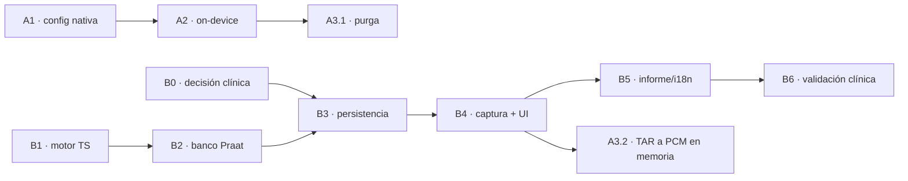

# Plan de trabajo: módulo de prosodia e integración del reconocimiento de voz

> Plan ejecutable derivado de [`evaluacion-prosodia-y-asr.md`](./evaluacion-prosodia-y-asr.md).
> Cada PR lleva ficheros concretos, criterios de aceptación y pruebas.
>
> **Dos líneas de trabajo independientes.** La A (reconocimiento) corrige riesgo
> de conformidad presente y no toca arquitectura. La B (prosodia) añade módulo
> clínico nuevo. **No se bloquean entre sí** y pueden ir en paralelo desde el
> primer día.

---

## Mapa general

| | Línea A — Reconocimiento de voz | Línea B — Prosodia |
|---|---|---|
| **Naturaleza** | Corrección de defectos + Zero-PHI | Módulo clínico nuevo |
| **Riesgo si no se hace** | Alto y presente (iOS caído, voz de menor a servidor) | Ninguno (funcionalidad ausente) |
| **Toca arquitectura** | No | No (reutiliza el DSP existente) |
| **Decisión regulatoria previa** | No | Sí, sobre las afirmaciones clínicas (B0) |
| **Esfuerzo** | ~5–8 días | ~4–6 semanas de software + validación clínica aparte |
| **PRs** | A1 → A2 → A3 (secuenciales) | B1 ∥ B2 → B3 → B4 → B5 |

**Orden recomendado de arranque:** A1 hoy (es un *blocker* de plataforma), y en
paralelo B1+B2, que son TypeScript puro y CI —no dependen de nadie.

---

## Línea A — Reconocimiento de voz en el TAR

No es una integración: el motor ya está montado en
`src/Screens/Articulation/articulationAudio.ts`. Es un saneamiento en tres PRs.

### PR A1 — Configuración nativa que falta ✅ *hecho*

> **Resuelto.** `NSSpeechRecognitionUsageDescription` añadida al `Info.plist`,
> `NSMicrophoneUsageDescription` corregida (ya no promete lo que el código no
> garantizaba), y `<queries>` declarado en el manifiesto para
> `RecognitionService` y para la actividad `RECOGNIZE_SPEECH`. Cubierto por
> `scripts/__tests__/nativeAudioConfig.test.js`, verificado revirtiendo las
> claves: el test falla.

**Problema.** iOS termina el proceso al pedir autorización a `SFSpeechRecognizer`
sin `NSSpeechRecognitionUsageDescription`; Android con `targetSdkVersion = 35`
no puede enlazar con el servicio de reconocimiento sin declarar `<queries>`.

**Cambios**

| Fichero | Cambio |
|---|---|
| `ios-native/VIAPlus/Info.plist` | Añadir `NSSpeechRecognitionUsageDescription` |
| `ios-native/VIAPlus/Info.plist` | Corregir `NSMicrophoneUsageDescription`: hoy afirma «Las grabaciones se procesan en el dispositivo», que es falso mientras A2 no esté hecho |
| `android/app/src/main/AndroidManifest.xml` | Añadir el bloque `<queries>` para `android.speech.RecognitionService` |

```xml
<queries>
  <intent>
    <action android:name="android.speech.RecognitionService" />
  </intent>
</queries>
```

**Prueba de regresión.** La configuración nativa no la cubre ningún test hoy, y
es justo donde se ha roto. Añadir un test que lea los ficheros y falle si
faltan las claves:

- `src/Screens/Articulation/__tests__/articulationNativeConfig.test.ts`
  - parsea `Info.plist` → exige `NSMicrophoneUsageDescription` y
    `NSSpeechRecognitionUsageDescription`.
  - parsea `AndroidManifest.xml` → exige `RECORD_AUDIO` y el `<intent>` de
    `RecognitionService`.

Es un test barato que convierte un fallo de campo silencioso en un fallo de CI.

**Aceptación**
- El TAR pide permiso de reconocimiento en iOS sin terminar el proceso.
- `recognitionAvailable` pasa a `true` en un Android 13+ con Google app.
- El test nuevo falla si se revierte cualquiera de las tres claves.

---

### PR A2 — Reconocimiento estrictamente *on-device* ✅ *hecho · pendiente de prueba en dispositivo*

> **Resultado del spike A2.0 (verificado leyendo el código de la librería, no
> supuesto).** `@react-native-voice/voice@3.2.4` **no permite** garantizar el
> modo local en ninguna de las dos plataformas:
>
> - **iOS** (`ios/Voice/Voice.m`): crea el `SFSpeechAudioBufferRecognitionRequest`
>   y solo fija `shouldReportPartialResults`. `requiresOnDeviceRecognition` **no
>   aparece en ningún fichero del paquete**, y `startSpeech` solo recibe el
>   locale y el callback.
> - **Android** (`VoiceModule.java`): las opciones se trasladan al
>   `RecognizerIntent` con un `switch` que es una **lista blanca sin rama
>   `default`**. Una clave no contemplada —`EXTRA_PREFER_OFFLINE`— se descarta
>   **en silencio**. La ruta 1 del plan queda descartada.
>
> **Lo implementado (A2.1): la puerta, con fallo CERRADO.**
> `articulationRecognition.ts` decide, y su tipo solo admite `'on-device'` y
> `'unavailable'` — **el modo `'server'` no se puede ni representar**. Lo que no
> se puede confirmar no se asume, así que hoy la puerta está cerrada y el
> T.A.R. degrada a SODA manual: **la voz del paciente no sale del equipo**, que
> es el objetivo de A2. Se retira además el reintento en la lengua base, porque
> la garantía de modo local se confirma para un locale concreto.
>
> **La capa nativa (ruta 2): implementada** con `patch-package`. iOS fija
> `requiresOnDeviceRecognition` y expone `supportsOnDeviceRecognition`; Android
> usa `createOnDeviceSpeechRecognizer()` desde API 31 y **no**
> `EXTRA_PREFER_OFFLINE`, porque el extra solo PREFIERE el modo local y el
> proveedor puede ignorarlo — con una preferencia no se firma una promesa
> Zero-PHI. Si el parche no estuviera aplicado, los métodos no existen, el
> sondeo devuelve `null` y la puerta se queda cerrada: su ausencia degrada con
> seguridad.
>
> **Pendiente: prueba en dispositivo real.** Aquí no hay SDK de Android ni
> Xcode (`dl.google.com` bloqueado), así que no se ha compilado ninguna de las
> dos plataformas. Sí se ha verificado que `javac` no da ningún error de
> sintaxis, que `clang` no da ninguno de gramática, y que el parche se aplica
> limpio desde un `npm ci` en frío.

**Problema.** Los reconocedores del sistema son de servidor por defecto. Hoy la
voz de un menor puede viajar a Apple o Google desde el módulo TAR.

**A2.0 — Spike previo (medio día, obligatorio).** Verificar qué expone
`@react-native-voice/voice@3.2.4`:

- **Android:** comprobar si `Voice.start(locale, options)` traslada extras al
  `RecognizerIntent` (se necesita `EXTRA_PREFER_OFFLINE`).
- **iOS:** comprobar si expone `requiresOnDeviceRecognition` de
  `SFSpeechRecognizer`. **Presunción de partida: no lo expone.**

Rutas según resultado, en orden de preferencia:

1. La librería lo soporta → pasar la opción y listo.
2. No lo soporta → `patch-package` sobre el módulo iOS (cambio de pocas líneas).
3. Si el parche resulta frágil → *TurboModule* propio mínimo, solo para el
   reconocimiento. Es el único punto de todo el plan donde puede hacer falta
   código nativo, y sigue siendo mucho menos superficie que embeber un runtime.

> Sherpa-ONNX **no** entra aquí. Resolvería el Zero-PHI, pero rompe el principio
> rector «cero IA en el dispositivo» y eso es una decisión de expediente, no de
> ingeniería. Va a la Línea A-bis (abajo), sin bloquear nada.

**A2.1 — Puerta de degradación.** El módulo ya tiene toda la maquinaria de
degradación construida; se le añade un caso más:

- Nuevo estado `recognitionOnDevice: boolean` en `ArticulationAudio`.
- Función pura y testeable `resolveRecognitionMode(caps, locale)` →
  `'on-device' | 'unavailable'`. **No existe el modo `'server'`.**
- Si no se puede garantizar reconocimiento local → `recognitionAvailable = false`
  y el TAR cae a clasificación SODA manual. **Preferimos no transcribir a
  transcribir en un servidor.**
- La pantalla ya pinta el chip de modo limitado (`ArticulationTestScreen.tsx:423`):
  se le añade el texto que explica el porqué.

**Pruebas**
- `articulationRecognitionMode.test.ts` — tabla de casos sobre
  `resolveRecognitionMode`: sin capacidad offline → `unavailable`; locale sin
  modelo local → `unavailable` (no fallback a servidor); caso feliz → `on-device`.

**Aceptación**
- En modo avión el TAR transcribe si el dispositivo tiene modelo local, y si no,
  muestra modo limitado — nunca queda esperando a red.
- Con red disponible pero sin modelo local, **no sale audio del dispositivo**
  (verificable con captura de tráfico en la prueba manual de aceptación).
- La frase del `Info.plist` corregida en A1 pasa a ser cierta.

---

### PR A3 — Purga del audio del TAR ✅ *hecho, por la vía A3.2*

> **Resuelto eliminando el fichero, no limpiándolo.** A3.1 (borrar el `.wav`)
> resultó impracticable: el proyecto no arrastra ninguna librería de sistema de
> ficheros y `react-native-audio-recorder-player` no expone borrado, así que
> habría exigido un módulo nativo nuevo para una sola llamada. Se hizo
> directamente **A3.2**: el T.A.R. captura PCM **en memoria** sobre el
> micrófono compartido de `@/Audio` y reproduce desde buffer, igual que el
> análisis de voz y el de prosodia. Zero-PHI **por diseño** y no por limpieza
> posterior; de paso, un solo motor de captura en toda la app y una dependencia
> menos. Cubierto por guardia de fuente en `nativeAudioConfig.test.js`.

**Problema.** No hay una sola llamada a `unlink` en `src/`. `toggleRecording()`
guarda el `audioUri` y `reset()` solo lo pone a `null`: el `.wav` queda en el
almacenamiento de la app indefinidamente.

**Dos pasos, deliberadamente separados.**

**A3.1 — Purga inmediata (1 día).** Añadir `purgeRecording()` al hook e
invocarla en los cuatro puntos donde el fichero deja de hacer falta: `reset()`,
desmontaje del componente, al guardar el test, y al pasar de ítem.

- Requiere una dependencia de sistema de ficheros. Preferir la que ya arrastre
  el árbol de dependencias antes que añadir `react-native-fs` solo para esto.
- Errores de borrado: registrar, nunca romper el flujo clínico.

**A3.2 — Converger al patrón de `VoiceAnalysis` (seguimiento).** El módulo de
voz **ya lo hace bien**: `voiceMicAdapter.ts` captura PCM en memoria vía
`react-native-audio-api` y **nunca escribe un fichero**. Zero-PHI por diseño en
vez de por limpieza posterior.

El TAR necesita reproducir la toma al clínico, así que la migración implica
reproducir desde buffer en memoria (soportado por `react-native-audio-api`).
Beneficio colateral: unifica el motor de captura de toda la app y elimina
`react-native-audio-recorder-player` del TAR.

> **Dependencia útil:** si B4 construye el adaptador de captura larga para
> prosodia (también sobre `react-native-audio-api` y el `sharedAudioContext`),
> A3.2 se vuelve casi gratis. Conviene hacer A3.2 **después** de B4.

**Pruebas**
- `articulationPurge.test.ts` — con recorder simulado, afirmar que el borrado se
  llama en reset, desmontaje, guardado y cambio de ítem; y que un fallo de
  borrado no propaga excepción.

---

### Línea A-bis — *Scoring* fonético ⏳ *mitad no acústica hecha · GOP pendiente*

> A-bis tiene **dos mitades**, y solo una estaba bloqueada.
>
> **HECHO — alineamiento fonémico y propuesta SODA** (`articulationPhonetics.ts`).
> La comparación era contención de cadenas: devolvía «coincide» o «no coincide».
> Ahora las dos cadenas se transcriben a fonemas —la ortografía española es
> casi biunívoca, así que la conversión es **reglada y auditable**, no
> estadística—, se alinean por distancia de edición y cada diferencia se
> traduce a su código: sustitución → S, omisión → O, adición → A. La pantalla
> propone y el clínico acepta. **Módulo puro: sin modelos, sin red, sin código
> nativo — el principio «cero IA en el dispositivo» queda intacto.**
>
> Cubre el seseo por defecto, porque el T.A.R. se usa en sesión dominicana y sin
> él cada «zapato» se marcaría como sustitución de un fonema que en esa variedad
> no existe.
>
> **Decisión regulatoria analizada** en
> [`adr-inferencia-en-dispositivo.md`](./adr-inferencia-en-dispositivo.md):
> recomienda **no** embarcar modelo, y abrir en su lugar la detección acústica
> **determinista** de distorsiones concretas (sigmatismo interdental, rotacismo,
> sonorización), que cubre buena parte de la D con DSP clásico y sin tocar el
> principio ni el expediente.
>
> **PENDIENTE — la mitad acústica (GOP sobre posteriorgramas).** Es la que
> detecta la **D (distorsión)**, y no es un detalle: una /s/ interdental o una
> /r/ mal vibrada producen **exactamente la misma cadena** que la producción
> correcta. Ninguna cantidad de análisis de texto las ve. Sigue exigiendo lo
> que ya decía este plan —decisión regulatoria sobre inferencia en el
> dispositivo y corpus infantil anotado— y además, en este entorno, los pesos
> no son descargables (Hugging Face bloqueado por política de red).

**No forma parte de este plan de entrega.** Se documenta para que no se
confunda con A2.

Un ASR de palabras normaliza hacia el diccionario y borra justo lo que mide
SODA: «tato» se transcribe «gato» (sustitución perdida) y una distorsión produce
la misma cadena que la producción correcta (categoría D invisible). Lo que el
TAR necesita es alineamiento forzado a nivel de fonema —posteriorgramas /
*Goodness of Pronunciation*— decodificando contra léxico fonético **sin modelo
de lenguaje**.

Prerrequisitos antes de escribir una línea de código:

1. Decisión del responsable regulatorio sobre si la inferencia en dispositivo
   rompe «cero IA en el dispositivo» y qué añade al expediente MDR.
2. Corpus de habla infantil española anotado por logopeda para validar.
3. Descartado `whisper-small` (LM pesado, alucinación en audio corto y atípico,
   cientos de MB). El candidato es Zipformer CTC.

Mientras tanto, el reconocimiento del TAR se mantiene como **ayuda de cribado**,
con la clasificación SODA firmada por el clínico. Conviene que la UI lo diga.

---

## Línea B — Módulo de prosodia

### B0 — Decisión clínica previa (bloquea B3–B5, no B1–B2) ✅ *cerrada*

> **Resuelta y RATIFICADA** en [`b0-prosodia-tarea-y-afirmaciones.md`](./b0-prosodia-tarea-y-afirmaciones.md):
> narración provocada con apoyo visual en dos bandas de edad, guion fijo,
> objetivo de 30–60 s de habla conectada válida; y afirmaciones **descriptivas,
> nunca normativas**. Los riesgos derivados están en
> [`prosodia-riesgos.md`](./prosodia-riesgos.md).

Dos cosas que el software no puede decidir solo:

**B0.1 — La tarea de habla.** La prosodia exige **20–60 s de habla conectada**, y
hoy no se captura en ningún sitio: `VoiceAnalysis` toma una /a/ sostenida (sin
prosodia por definición) y el TAR palabras aisladas de menos de 1 s. Hay que
definir con logopedia:

- Lámina descriptiva por franja de edad (para preescolares y prelectores).
- Texto de lectura en voz alta (para los que ya leen).
- Duración objetivo, consigna hablada (que iría al corpus de `tools/nos/`) y
  criterios de toma válida.

**B0.2 — Qué se afirma.** No hay baremos pediátricos españoles de prosodia
disponibles y consolidados. Sin normativa, el módulo **debe reportar métricas
descriptivas y señales cualitativas, no percentiles ni z-scores**. Es la misma
honestidad que ya practica el DSP cuando declara «formantes no estimables» en
lugar de inventar un número. Afirmar normalidad sin baremo es un problema de
expediente, no de código.

---

### B1 — Motor de prosodia en TypeScript ⚙️ *sin dependencias nuevas*

**Fichero nuevo:** `src/Screens/ProsodyAnalysis/prosodyDsp.ts` — puro, sin React
Native ni UI (mismo contrato que `voiceDsp.ts`, que es lo que permite compilarlo
en build-time).

**Reutiliza tal cual de `voiceDsp.ts`:** `conditionForAnalysis`,
`createDecimator3`, `createVoiceHighpass`, `analyseFrame`, `SAMPLE_RATE`,
`FRAME`, y los umbrales `SILENCE_RMS` / `VOICED_RMS_FRACTION` / `MIN_PEAK`.

**Métricas** (todas derivadas de vectores que `analysePcm()` ya produce):

| Métrica | Derivación | Insumo |
|---|---|---|
| Nº y duración de pausas | rachas de tramas bajo `SILENCE_RMS`, con histéresis y duración mínima (~250 ms) | `frameRms[]` |
| Tiempo de fonación / locución | suma de tramas sonoras vs. duración total | `stats` |
| Tasa de habla | núcleos silábicos ÷ duración total | picos de intensidad |
| Tasa de articulación | núcleos silábicos ÷ (duración − pausas) | ídem |
| Rango tonal | percentiles 5–95 de `f0s[]` en **semitonos** | `f0s[]` |
| Variabilidad de F0 | SD en semitonos (independiente de sexo y edad) | `f0s[]` |
| Contorno final | pendiente de F0 del último tramo sonoro (ascenso/descenso) | `f0s[]` |
| Variación de intensidad | SD del RMS en dB sobre tramas sonoras | `frameRms[]` |
| Fracción sonora | `voicedFrames / totalFrames` | `stats` |

**Detalles técnicos que hay que resolver bien**

- **Semitonos, no Hz.** `12·log2(f/f_ref)` con `f_ref = 100 Hz`. Es lo que hace
  comparable a un niño de 4 años con uno de 7. Reportar el rango en Hz sería
  confundir crecimiento con prosodia.
- **Núcleos silábicos** es la métrica más delicada. Método de picos de
  intensidad (De Jong & Wempe): picos sobre umbral relativo, separados un mínimo
  temporal, restringidos a tramas sonoras. Se valida en B2 contra recuento
  manual sobre las señales sintéticas.
- **Rendimiento.** 60 s a 16 kHz = ~940 tramas de 64 ms; cada una con
  autocorrelación sobre lags 32–228. Es más de lo que el módulo de voz procesa
  hoy: hay que reutilizar el patrón `yieldToEventLoop()` que ya existe en
  `voiceDsp.ts:387` para no congelar la UI, y medir en gama baja.
- **Memoria.** 60 s en `Float32Array` a 16 kHz ≈ 3.8 MB. Asumible, pero la
  captura debe decimar al vuelo como ya hace `voiceMicAdapter`, no acumular a
  48 kHz.

**Pruebas:** `src/Screens/ProsodyAnalysis/__tests__/prosodyDsp.test.ts` sobre PCM
sintético (mismo enfoque que `voiceDsp.test.ts`): pausas de duración conocida,
contorno de F0 conocido, número de sílabas conocido.

---

### B2 — Banco de validación contra Praat 🔬 *en paralelo con B1*

Esta es la razón principal para hacer prosodia en TypeScript: **el oráculo ya
existe** y se extiende, en vez de construirlo.

| Fichero | Cambio |
|---|---|
| `tools/acoustics/fixtures.js` | Casos nuevos de **habla conectada sintética**: sílabas concatenadas con F0, pausas y tasa **deterministas y conocidas** (sin `Math.random`, como el resto del banco) |
| `tools/acoustics/validate.py` | Nuevas entradas en `TOLERANCES` y medida con Praat (`To Pitch`, `To Intensity`) de las mismas señales |
| `tools/acoustics/README.md` | Documentar las métricas nuevas y qué NO valida |
| `.github/workflows/acoustic-validation.yml` | Añadir `src/Screens/ProsodyAnalysis/**` a los `paths` de disparo |

**Tolerancias propuestas** (a ajustar con la primera pasada, igual que se hizo
con F0/HNR/formantes):

| Parámetro | Tolerancia inicial | Nota |
|---|---|---|
| `pause_count` | 0 | exacto: es discreto y la señal es sintética |
| `pause_total_s` | 0.05 s | |
| `f0_range_st` | 1.0 st | |
| `f0_sd_st` | 0.5 st | |
| `speech_rate_sps` | 0.3 síl/s | la más incierta; el método de picos difiere entre implementaciones |

**Aquí puede entrar DisVoice** — como referencia de build-time junto a Praat,
que es exactamente el papel que la propuesta original le daba en el dispositivo.
Instalado en `requirements.txt`, corriendo en el runner, sin tocar la app.

**Criterio de aceptación:** el banco pasa en CI **antes** de que exista una sola
pantalla. El módulo nace validado.

---

### B3 — Persistencia

Sigue el patrón exacto de `VoiceAnalysis` / `ArticulationTest`.

| Fichero | Contenido |
|---|---|
| `src/Models/ProsodyAnalysis/ProsodyAnalysis.ts` | Entidad `prosody_analysis` + `ProsodyAnalysisDTO`, con los `@Transform` de fechas y `@Exclude` de `evaluation` |
| `src/Models/ProsodyAnalysis/index.ts` | Reexport |
| `src/Database/config.ts` | Registrar la entidad en `entities` (**imprescindible**: con `synchronize: true` es lo que crea la tabla) |
| `src/Database/migrations/1718900000600-CreateProsodyAnalysis.ts` | Migración opcional, timestamp posterior a `…500` |
| `src/Repositories/ProsodyAnalysisRepository.ts` | Sobre `base.ts` |
| `src/Services/local/modules/prosodyAnalysis/` | `create` · `getById` · `getByEvaluation` · `update` · `delete` |
| `src/Services/local/modules/index.ts` | Reexport |

**Campos nullable, por doctrina del proyecto.** Igual que `VoiceAnalysis` admite
`f0: null` («análisis no disponible, cierre manual»), la prosodia debe poder
guardarse con métricas nulas cuando la toma no es analizable. **Nunca escribir un
número que no se ha medido.**

**Zero-PHI:** la entidad guarda métricas, jamás audio ni transcripción.

---

### B4 — Captura y pantalla

| Fichero | Contenido |
|---|---|
| `src/Screens/ProsodyAnalysis/prosodyMicAdapter.ts` | Captura larga. **Debe usar `acquireAudioContext()` de `@/Audio`** — abrir un `AudioContext` propio es exactamente el fallo documentado en `docs/design/arquitectura-audio.md` (en Android el segundo stream falla en silencio y el módulo queda mudo para siempre) |
| `src/Screens/ProsodyAnalysis/useProsodyAnalysis.ts` | Ciclo de vida: permiso → consigna hablada → captura → análisis → resultado |
| `src/Screens/ProsodyAnalysis/ProsodyAnalysisScreen.tsx` | UI: consigna, lámina/texto, medidor de nivel, cuenta atrás, resultados |
| `src/Screens/ProsodyAnalysis/prosodyResult.ts` | Interpretación y umbrales cualitativos (ver B0.2) |
| `src/Screens/ProsodyAnalysis/index.ts` | Reexport |
| `src/Navigators/Default.tsx` | `<RootStack.Screen name="ProsodyAnalysis" …>` |
| `src/Screens/SeleccionEjercicios/SeleccionEjerciciosScreen.tsx` | Entrada en la lista de módulos (id, título, duración, franja de edad, icono, color, tag `LENGUAJE`) |
| `src/Screens/SeleccionEjercicios/ModuleIllustration.tsx` | Ilustración del módulo |

**Requisitos de UX propios de una toma larga**

- Detección de toma inválida **durante** la captura, no después: demasiado
  silencio, saturación, ruido de sala. Un niño de 5 años no repite una toma de
  45 s tres veces.
- Enlazar con el módulo `RoomNoiseCheck` que ya existe: una toma prosódica en
  sala ruidosa no es interpretable.
- Reintento y cierre manual, como el resto de módulos.

**Pruebas:** `prosodyMicLifecycle.test.ts` calcado de `voiceMicLifecycle.test.ts`
(adquisición/liberación del contexto compartido, una sola suscripción,
desmontaje limpio).

---

### B5 — Informe, idiomas y telemetría

| Fichero | Cambio |
|---|---|
| `src/PDF/blocks/ProsodyDetail.ts` + `index.ts` | Bloque de informe |
| `src/I18n/locales/{es,en,es-DO}/` | Claves del módulo |
| `src/Telemetry/` | Instrumentar el módulo (el README declara cobertura 9/9; pasa a 10/10) |
| `tools/nos/` corpus | Consigna hablada del módulo, si B0.1 la define |
| `README.md` | Módulo 12 en la batería, tabla de estado, y actualizar el módulo 9 con lo que cambie en la Línea A |
| `docs/manual/` | Manual de usuario |
| Expediente de riesgos | Nueva entrada ISO 14971 |

---

### B6 — Validación clínica (fuera del software) ⏳ *Parte A firmada · Parte B pendiente de datos*

> Protocolo en [`validacion-clinica-prosodia.md`](./validacion-clinica-prosodia.md),
> firma en `assets/prosody-approval.json`, banco de medición en
> `tools/acoustics/concordance.js`. La Parte A (juicio clínico sobre tarea,
> estímulos y afirmaciones) está ratificada; la Parte B (concordancia del
> recuento silábico con anotación manual) **exige grabaciones reales** y no se
> puede cerrar con una firma.

El propio `tools/acoustics/README.md` ya avisa de este límite:

> Señales **sintéticas**. Que VIA+ coincida con Praat sobre ellas dice que el
> cálculo es correcto, no que la medida sea clínicamente válida sobre voz real
> de niño […] Eso exige un contraste con grabaciones reales anotadas por un
> logopeda.

Vale idéntico para la prosodia, y con más fuerza: la tasa de habla y el recuento
de sílabas sobre habla infantil real, con disfluencias y ruido de sala, es un
problema bastante más duro que sobre señal sintética. **Ninguna afirmación
clínica del módulo debe publicarse antes de esto.**

---

## Dependencias y paralelismo



- **A1 arranca ya.** Es un fallo de plataforma, no una decisión.
- **B1 y B2 arrancan ya**, en paralelo: TypeScript puro y CI, sin dependencia de
  B0 ni de la infraestructura de módulos.
- **B0 es el camino crítico real** de la Línea B: sin tarea de habla definida no
  hay pantalla que construir. Conviene lanzarlo con logopedia el primer día.
- **A3.2 se cuelga de B4** a propósito: el adaptador de captura en memoria que
  necesita prosodia es el mismo que necesita el TAR.

---

## Riesgos

| Riesgo | Prob. | Impacto | Mitigación |
|---|---|---|---|
| La librería de voz no expone modo on-device en iOS | Alta | Medio | Spike A2.0 con tres rutas ya previstas (opción → parche → TurboModule mínimo) |
| Sin baremos pediátricos de prosodia en español | Alta | Alto en las afirmaciones | B0.2: reportar descriptivo, no normativo |
| Recuento silábico poco fiable en habla infantil real | Media | Medio | B2 lo mide sobre sintético; B6 sobre real. Si no alcanza fiabilidad, se retira esa métrica y se conservan pausas y F0, que son robustas |
| Niños que no completan 30–60 s de habla | Media | Medio | Tarea por franja de edad (B0.1) + detección de toma inválida en vivo (B4) |
| Rendimiento del análisis en gama baja | Baja | Medio | `yieldToEventLoop()` ya resuelto en el DSP; medir pronto en dispositivo real |
| Nuevo módulo amplía el expediente MDR | Cierta | Medio | B5 incluye riesgos y manual; ninguna dependencia ni runtime nuevo que declarar |

---

## Lo que este plan NO hace, y por qué

- **No embebe Python** (Chaquopy/BeeWare). Es Android-only —dejaría una métrica
  clínica presente en una plataforma y ausente en otra—, añade decenas de MB y un
  segundo runtime al expediente y al SBOM, y no aporta exactitud: `voiceDsp.ts`
  ya coincide con Praat al decimal en F0. Praat y DisVoice se quedan donde ya
  están y donde son útiles: en CI, como juez.
- **No embarca modelos ASR** en esta entrega. Resolvería el Zero-PHI, pero a
  cambio de romper «cero IA en el dispositivo», que es la línea argumental del
  expediente. A2 alcanza el mismo objetivo de privacidad sin tocarla.
- **No cuelga la prosodia del TAR.** Palabras aisladas de menos de un segundo dan
  métricas calculables y clínicamente vacías.

---

## Primer paso concreto

**PR A1**, hoy: tres claves de configuración nativa y un test que impide que
vuelvan a perderse. Devuelve el reconocimiento del TAR en iOS y en Android
moderno, y no exige ninguna decisión pendiente de nadie.
